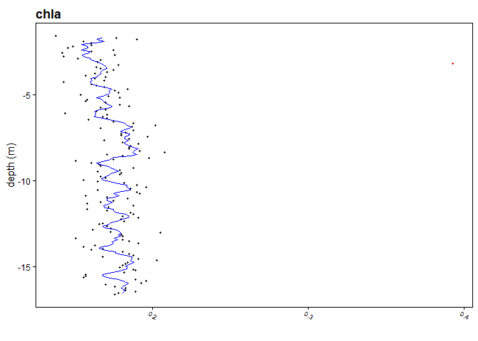

<!-- README.md is generated from README.Rmd. Please edit that file -->

# SILViA: Sample Incongruents Labeling and Visualization Approach

<!-- badges: start -->
<!-- badges: end -->

The goal of SILViA is to provide a method to identify outlying points
recorded by a [Valeport](https://www.valeport.co.uk) CTD device along a
depth profile, which are not congruent with the range of measurements
taken in the surrounding water column. These are labeled as
“incongruent” points.  
For this, the package includes a function to import and format .vp2
files, as well as functions to visualize depth profiles and the
incongruent points they contain.

## Installation

You can install the development version of SILViA from
[GitHub](https://github.com/) with:

``` r
install.packages("devtools")
devtools::install_github("KemenesT/SILViA")
library(SILViA)
```

## Usage

### Reading .vp2 files

The `read_vp2()` function is designed to read .vp2 files from Valeport
SWIFT CTD devices. The content of these files differs depending on
whether the device measures turbidity data or chlorophyll (through
fluorescence). Thus the function takes as input a directory to read
files from, the content that can be expected in the files, and the ID of
the device. This last input is recorded in the file name produced by a
SWIFT device.  
Files from different devices may thus be stored within the same
directory without preventing the function from reading the correct data.

``` r
# This function uses the package data `ctdat` to create example .vp2 files in 
# the temporary directory tempdir().
setup_example()

# The temporary files with example IDs "12345" for a chlorophyll-measuring CTD, 
# and "54321" for a turbidity-measuring CTD can be seen in the temporary 
# directory.
list.files(tempdir(), pattern = ".vp2") 
#> [1] "VL_12345_00000000000155b4609e492f.vp2"
#> [2] "VL_12345_00000000000255b43991379d.vp2"
#> [3] "VL_12345_00000000000355b427925258.vp2"
#> [4] "VL_12345_00000000000455b4774a1914.vp2"
#> [5] "VL_12345_00000000000555b4408627b0.vp2"
#> [6] "VL_54321_00000000000655b4de52b9f.vp2"

# Loading in the files from the CTD with ID "12345" can be done as:
chlorophyll_CTD_data <- read_vp2(directory = tempdir(), 
                                 type = "Chlorophyll", ID = "12345")
```

All the five different files are stacked in a single data frame as
follows:

|     | date       | time         | depth | pressure |       sv |   temp |    sal |     dens |   cond |  chla | filename                              |     lat |       lon |
|:----|:-----------|:-------------|------:|---------:|---------:|-------:|-------:|---------:|-------:|------:|:--------------------------------------|--------:|----------:|
| 2   | 2022/02/16 | 13:46:45.000 | 0.209 |    0.210 | 1540.338 | 26.882 | 36.408 | 1023.818 | 57.007 | 2.087 | VL_12345_00000000000155b4609e492f.vp2 | 30.5637 | -44.46387 |
| 3   | 2022/02/16 | 13:46:45.469 | 0.301 |    0.302 | 1540.348 | 26.810 | 36.571 | 1023.964 | 57.154 | 6.410 | VL_12345_00000000000155b4609e492f.vp2 | 30.5637 | -44.46387 |
| 4   | 2022/02/16 | 13:46:48.406 | 0.398 |    0.400 | 1540.321 | 26.689 | 36.804 | 1024.179 | 57.344 | 0.440 | VL_12345_00000000000155b4609e492f.vp2 | 30.5637 | -44.46387 |
| 5   | 2022/02/16 | 13:46:50.313 | 0.500 |    0.503 | 1539.953 | 26.679 | 36.477 | 1023.936 | 56.880 | 0.151 | VL_12345_00000000000155b4609e492f.vp2 | 30.5637 | -44.46387 |
| 6   | 2022/02/16 | 13:46:56.094 | 0.597 |    0.600 | 1539.909 | 26.670 | 36.453 | 1023.921 | 56.837 | 0.145 | VL_12345_00000000000155b4609e492f.vp2 | 30.5637 | -44.46387 |
| 7   | 2022/02/16 | 13:46:56.906 | 0.702 |    0.706 | 1539.951 | 26.680 | 36.469 | 1023.930 | 56.871 | 0.150 | VL_12345_00000000000155b4609e492f.vp2 | 30.5637 | -44.46387 |

``` r
# Note that only files from the desired CTD were imported:
unique(chlorophyll_CTD_data$filename)
#> [1] "VL_12345_00000000000155b4609e492f.vp2"
#> [2] "VL_12345_00000000000255b43991379d.vp2"
#> [3] "VL_12345_00000000000355b427925258.vp2"
#> [4] "VL_12345_00000000000455b4774a1914.vp2"
#> [5] "VL_12345_00000000000555b4408627b0.vp2"

# And that the data corresponds to chlorophyll measurements ("chla"):
colnames(chlorophyll_CTD_data)
#>  [1] "date"     "time"     "depth"    "pressure" "sv"       "temp"    
#>  [7] "sal"      "dens"     "cond"     "chla"     "filename" "lat"     
#> [13] "lon"

# To clear the temporary directory after using `setup_example()` use:
unlink(paste0(tempdir(), "\\", list.files(tempdir(), pattern = ".vp2")))
```

### Identifying Incongruent Points

The function `label_incongruents()` takes data as produced by
`read_vp2()` and adds two additional columns for every variable measured
by the CTD. Therefore, it also requires as input and expectation of the
kind of data that it receives. Here we specify:

- df1 = The chlorophyll data imported in the example above.  
- W = a depth window of 1m in which to consider the homogeneity of
  measurements.  
- alpha = a significance level of 0.1% for determining when an unlikely
  value is labeled as “incongruent”.  
- type = “Chlorophyll” so that the function knows to expect input data
  containing chlorophyll values.

``` r
labeled_data <- label_incongruents(df1 = chlorophyll_CTD_data, W = 1, 
                                   alpha = 0.001, type = "Chlorophyll")
```

The resulting data-frame contains new columns indicating for each
variable and each point whether it is labeled as incongruent
(‘Yes’/‘No’), and the p-value on which this decision is based. For
example:

|     | incongruent_temp |   pV_temp | incongruent_sal |    pV_sal |
|:----|:-----------------|----------:|:----------------|----------:|
| 2   | No               | 0.0150036 | No              | 0.8184680 |
| 3   | No               | 0.1425257 | No              | 0.3594200 |
| 4   | No               | 0.6728842 | Yes             | 0.0004519 |
| 5   | No               | 0.6786882 | No              | 0.6364872 |
| 6   | No               | 0.7086800 | No              | 0.7004968 |
| 7   | No               | 0.6416948 | No              | 0.6463254 |

### Plotting Profiles

Finally you can plot these results to visualize the labeled
incongruents.

The function `plot_profiles()` creates a “profiles.pdf” file in the
desired directory where each page contains plots for 6 variables
recorded by a CTD in a single cast: sound velocity, temperature,
salinity, density, conductivity, and either chlorophyll-a or turbidity.

Additionally, it outputs the data-frame with labeled incongruents used
to create these plots. This means that you can use `plot_profiles()`
directly if you want the labeled data frame and plots.

``` r
# After running this line check your working directory for the "profiles.pdf" file!
labeled_data <- plot_profiles(data = chlorophyll_CTD_data, width = 1, 
                              alpha = 0.001, type = "Chlorophyll", min.depth = 1.5)
#> A pdf with profiles was created in directory: C:/Users/thoma/Documents/SILViA

# To clear the pdf file created use the following line:
unlink(paste0(getwd(), "/profiles.pdf"))
```

The plots produced in the pdf look like this:



Here the blue line is a moving average and red data points are those
labeled to be incongruent.
